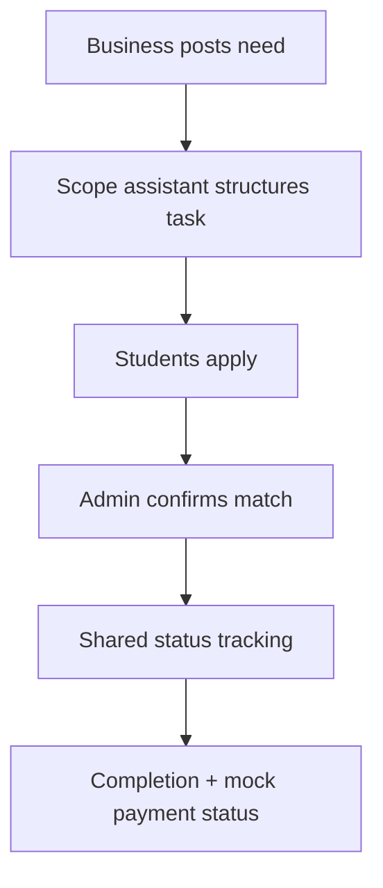

# SkillBridge Local

SkillBridge Local is an MVP marketplace that connects small local businesses with students for clearly scoped micro tech tasks. Businesses describe a need, the scope assistant structures it, students apply, an admin confirms the match, and everyone can follow delivery status.

**Live demo:** [skillbridge-local-chennai.netlify.app](https://skillbridge-local-chennai.netlify.app)

The deployed product includes a persistent, no-login demo workspace so the complete workflow can be tested immediately. Supabase is used for the production-ready schema, RLS policies, and public marketplace feed. Payment stages are deliberately mock-only in this MVP.

## What is included

- Public marketplace landing page
- Business dashboard with task posting and AI-assisted scope generation
- Student dashboard with skill-based task discovery and applications
- Admin dashboard with candidate ranking, assignment, delivery tracking, and activity feed
- Shared status flow: `open → reviewing → assigned → in progress → review → completed`
- Browser-persisted demo state with a one-click reset
- Live public-task feed read directly from Supabase with RLS
- Supabase migration, RLS policies, explicit Data API grants, and seed data
- Netlify build configuration and security headers
- Unit tests for the scope generator

## Stack

- Next.js 16 App Router + React 19
- Tailwind CSS 4
- Supabase Postgres + Row Level Security
- Netlify static hosting for the Next.js export
- TypeScript, Zod, Vitest, and Lucide icons

## Quick start

Requirements: Node.js 22 or newer (Node 24 is used in Netlify).

```bash
npm install
cp .env.example .env.local
npm run dev
```

Open [http://localhost:3000](http://localhost:3000), then launch the demo. The app remains fully usable in local demo mode when Supabase variables are not yet configured.

Run all checks:

```bash
npm run check
```

Or run them separately:

```bash
npm run lint
npm run typecheck
npm run test
npm run build
```

## Supabase setup

1. Create a Supabase project in an India or nearby region.
2. Install or run the Supabase CLI and link the repository to the project.
3. Apply the migration and seed data.
4. Add the project URL and publishable key to `.env.local`.

```bash
npx supabase@2.109.1 login
npx supabase@2.109.1 link --project-ref YOUR_PROJECT_REF
npx supabase@2.109.1 db push
npx supabase@2.109.1 db seed
```

```env
NEXT_PUBLIC_SUPABASE_URL=https://YOUR_PROJECT_REF.supabase.co
NEXT_PUBLIC_SUPABASE_PUBLISHABLE_KEY=sb_publishable_...
NEXT_PUBLIC_SITE_URL=http://localhost:3000
```

Only a Supabase publishable key belongs in the frontend. Never add a secret key or `service_role` key to a `NEXT_PUBLIC_` variable.

The schema is in [`supabase/migrations`](./supabase/migrations) and sample public tasks are in [`supabase/seed.sql`](./supabase/seed.sql). All public-schema tables have RLS enabled. Access is explicitly granted because newer Supabase projects do not automatically expose SQL-created tables to the Data API.

### Auth roles for the next iteration

The schema supports `business`, `student`, and `admin` profiles. A signup trigger accepts only `business` or `student`; it never self-assigns `admin`. Admin authorization is read from protected `app_metadata`, not editable user metadata.

For a real admin account, set `app_metadata.role = admin` through a trusted server-side process or the Supabase dashboard. Do not expose this operation to the browser.

## Netlify deployment

The checked-in [`netlify.toml`](./netlify.toml) uses `npm run build` and publishes the generated `out` directory. The MVP is intentionally exported as a static Next.js application: interactive state runs in the browser and the public task feed talks directly to Supabase with a publishable key protected by RLS. This keeps the first deployment simple and portable.

### Deploy from Git

1. Push this repository to GitHub.
2. In Netlify, choose **Add new project → Import an existing project**.
3. Select the GitHub repository. Netlify will detect the settings from `netlify.toml`.
4. Add these environment variables for Production and Deploy Previews:
   - `NEXT_PUBLIC_SUPABASE_URL`
   - `NEXT_PUBLIC_SUPABASE_PUBLISHABLE_KEY`
   - `NEXT_PUBLIC_SITE_URL` (your final Netlify URL)
5. Deploy, then update `NEXT_PUBLIC_SITE_URL` if Netlify assigned a different URL and redeploy.

### Deploy with the CLI

```bash
npx netlify-cli status
npx netlify-cli init
npx netlify-cli deploy
npx netlify-cli deploy --prod
```

Use a preview deploy first when changing backend configuration.

## Product flow



The current scope assistant is deterministic and runs in the browser, which keeps the demo free and reliable. It can later be moved behind a server endpoint and replaced with a hosted LLM while retaining the same structured `ScopeResult` contract.

## Project structure

```text
src/
  app/
    dashboard/        Business, student and admin routes
  components/
    dashboard/        Role-specific interactive views
    workspace-provider.tsx
  lib/                Types, seed state, Supabase client, formatting and scoping logic
supabase/
  migrations/         Schema, grants, triggers and RLS policies
  seed.sql             Public demo tasks
netlify.toml           Build and response-header configuration
```

## MVP boundaries

- No real payment provider or money movement
- Demo writes stay in browser storage; the live Supabase feed is read-only for anonymous visitors
- Email authentication screens, messaging, file uploads, notifications, and dispute resolution are next-phase features
- AI scope generation is assistive and should always be confirmed by the business owner

## Suggested next milestones

1. Supabase email/OTP authentication and onboarding for business/student roles
2. Authenticated Supabase writes for tasks, applications, and updates
3. Admin invitations and audit log
4. In-app messaging and file handover
5. Real AI provider with usage limits and human confirmation
6. Escrow or payment integration after pilot validation

## License

This repository is an MVP demonstration. Choose and add an appropriate license before public reuse or commercial distribution.
